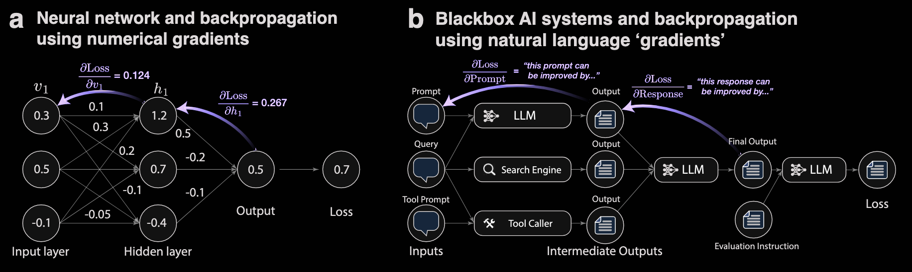
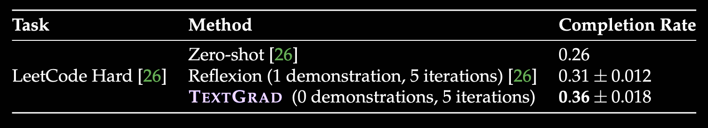

# TextGrad: Automatic “Differentiation” via Text

## 1. 背景：为什么复合 AI 系统需要新的优化方法

论文将新一代 AI 应用称为 **compound AI systems**：最终系统不是单个神经网络，而是多个模型、提示词、工具和评价函数的组合。设一个系统接受输入 $x$，经过多个变量和函数得到输出：

$$
x \rightarrow v_1 \rightarrow v_2 \rightarrow \cdots \rightarrow \hat y,
\qquad L = \mathcal{L}(\hat y, y).
$$

在普通神经网络中，可以计算每个参数的数值梯度 $\partial L/\partial \theta$，然后用梯度下降更新参数。但复合系统有三类困难：

1. **黑盒性**：LLM API、搜索器、代码执行器和人工/模型评价器通常只提供输入输出，不提供内部梯度。
2. **变量非连续**：提示词、程序、治疗计划等不是普通实数向量。
3. **目标复杂且难以微分**：目标可能是“代码通过隐藏测试”“答案正确”“分子具有更好结合能力”，反馈通常是离散或自然语言形式。

论文的关键类比是：数值梯度回答“参数应该向哪个数值方向移动”，而 LLM 反馈可以回答“当前变量哪里有问题、下一步应该怎样修改”。因此，TextGrad 用自然语言反馈构造 **textual gradients**。

## 2. TextGrad 的计算图与核心抽象

### 2.1 与 PyTorch 的对应关系

论文有意复用 PyTorch 的语法和抽象。图 1(c) 所表达的对应关系可以概括为：

| 数值深度学习 | TextGrad |
|---|---|
| `Tensor` / parameter | `Variable` |
| differentiable function | LLM 或黑盒函数 |
| scalar loss | textual evaluation / loss |
| `loss.backward()` | 通过 LLM 生成并反向传播文本反馈 |
| `optimizer.step()` | Textual Gradient Descent 更新变量 |

变量可以设置 `requires_grad=True`，并附带 `role_description`，说明它在系统中承担的角色，例如“system prompt”“Python solution”“molecular SMILES”。角色描述为反馈模型提供了变量的语义上下文。

### 2.2 文本梯度的定义

论文用 $\nabla_{\mathrm{LLM}}$ 表示由 LLM 实现的文本反馈算子，而非真正的数值导数。例如，对预测变量 $\hat y$ 和评价结果 $L$，文本梯度可以写作：

$$
\nabla_{\mathrm{LLM}}(\hat y, L)
$$

其输出不是向量，而是自然语言评价，例如“当前答案忽略了边界情况”“提示词没有要求模型核对数量”“应增加芳香环或极性基团以改善相互作用”。

如果变量 $v$ 位于多个下游节点之前，系统会收集来自所有 successor 的反馈，并将它们综合成对 $v$ 的更新建议。论文将此过程类比为链式法则和反向传播：反馈从最终目标向计算图上游传播。

文章将文本梯度类比数值梯度方向传播的workflow如下图所示：

### 2.3 Textual Gradient Descent

数值梯度下降为：

$$
\theta_{t+1}=\theta_t-\eta\nabla_\theta L(\theta_t).
$$

TextGrad 中的更新不是数值减法，而是由文本优化器完成：

$$
v_{t+1}=\mathrm{LLM}_{\mathrm{optimizer}}(v_t,\, \text{role}(v),\, \text{feedback}(v)).
$$

其中 `feedback(v)` 由当前变量在下游任务中的表现、上下文和其他节点反馈共同构成。文本优化器的目标是“提出一个更符合反馈的新版本”，而不是计算一个严格的最小化方向。

## 3. 算法流程

对一个需要优化的变量 $v$，TextGrad 的基本循环是：

1. **Forward pass**：运行当前复合系统，得到预测、代码执行结果或其他输出。
2. **Loss / evaluation**：通过任务评价器、单元测试或 LLM evaluator 产生反馈。
3. **Backward pass**：从 loss 节点开始，沿计算图反向调用 textual gradient operator。
4. **Feedback accumulation**：对同一变量汇总多个下游节点的反馈。
5. **Optimizer step**：Textual Gradient Descent 根据反馈重写变量。
6. **Iteration / validation**：重复多轮并保留验证集上更好的版本。

论文还实现了两个重要扩展：

- **Batch optimization**：对多个训练样本的 loss 使用 `tg.sum` 汇总，使一个 prompt 能根据批量反馈更新。
- **Momentum**：保留历史文本反馈，避免新反馈使变量反复改变或遗忘之前的有效修复。

## 4. 实验一：代码优化

### 4.1 任务设置

论文在 **LeetCode Hard** 上优化代码。代码优化目标写作：

$$
\text{Code-Refinement Objective}
=\mathrm{LLM}(\text{Problem}+\text{Code}+\text{Test-time Instruction}+\text{Local Test Results}).
$$

模型只能看到问题、当前实现和局部测试结果；真正的隐藏测试由 LeetCode 平台执行，因此该设置检验了系统能否根据有限反馈发现潜在错误。

baseline：GPT-4（zero-shot，reflexion），GPT-4o（zero-shot，reflexion）

### 4.2 结果

- GPT-4 zero-shot完成率约为 7%，Reflexion 约为 15%（论文引用的既有结果）。
- GPT-4o zero-shot 约为 26%，Reflexion 约为 31%。（文章page7中说zero-shot完成率为23%但page8的表中说zero-shot完成率为26%，暂以表中数据为准）
- TextGrad 达到约 **36%**，且没有使用 in-context demonstration。

## 5. 实验二：Prompt optimization for reasoning

### 5.1 实验目的与设置

该实验不是针对某一道题优化答案，而是优化一个能够在整个 benchmark 上复用的 **system prompt**。论文使用 `gpt-3.5-turbo-0125` 作为真正执行推理的 **forward model**，使用更强的 `gpt-4o` 作为 **gradient engine**，根据训练样本上的错误答案生成 textual feedback。

实验包含三个数据集：

| Dataset | 来源与划分 | 评价指标 |
|---|---|---|
| **Object Counting** | BIG-Bench Hard；随机划分为 50 train / 100 validation / 100 test | string-based exact match，最终数字与 ground truth 完全一致才算正确 |
| **Word Sorting** | BIG-Bench Hard；随机划分为 50 train / 100 validation / 100 test | 使用 LLM 比较模型输出与 ground-truth answer |
| **GSM8K** | grade-school math problem solving；采用 DSPy 使用的 train/validation/test 划分 | string-based exact match，最终答案数字与标准答案一致 |

TextGrad 的具体配置为：每次迭代随机采样 3 个训练样本，连续优化 12 次，因此总共使用 36 个 training examples（允许 with replacement）。每轮更新后在 validation set 上评估，只有当验证性能优于当前 prompt 时才保留更新后的 prompt。

### 5.2 Baseline

论文采用两个主要 baseline：

1. **Zero-shot Chain-of-Thought（CoT）**：初始化 prompt 为“Think step-by-step”，要求模型先解释推理过程再给答案。这是没有示例的强 prompt baseline。
2. **DSPy BootstrappedFewShotRandomSearch（BFSR）**：使用 10 个 candidate programs 和最多 8 个 few-shot demonstrations。DSPy 先收集能够通过评价指标的输入-输出 reasoning traces，再对最多 8 个示例的组合进行 random search。因此 DSPy baseline 使用了 demonstrations，而 TextGrad 是 **instruction-only、0 demonstrations**。

需要注意，TextGrad 与 DSPy 优化的对象不同：DSPy 主要搜索应放入 prompt 的示例，TextGrad 主要重写 instruction。论文还报告二者可以组合使用。

### 5.3 实验结果

| Dataset | CoT（0-shot） | DSPy（BFSR，8 demonstrations） | TextGrad（instruction-only，0 demonstrations） |
|---|---:|---:|---:|
| Object Counting | 77.8% | 84.9% | **91.9%** |
| Word Sorting | 76.7% | **79.8%** | **79.8%** |
| GSM8K | 72.9% | **81.1%** | **81.1%** |

TextGrad 在 Object Counting 上比 CoT 提升 14.1 个百分点，比 DSPy 提升 7.0 个百分点；在 Word Sorting 和 GSM8K 上达到与 DSPy 相同的准确率，同时没有引入 8 个 few-shot examples。对 GSM8K，初始 prompt 的准确率为 72.9%，经过 12 次迭代后达到 81.1%。优化后的 prompt 增加了 `Restate the problem`、`Break down the problem into smaller steps`、`Verify each step` 和 `re-check your calculations` 等具体约束。

论文进一步做了组合实验：在 TextGrad 优化后的 instruction 上加入 DSPy 选出的 demonstrations，GSM8K 准确率可以从 81.1% 提升到 **82.1%**。这说明 TextGrad 的 instruction optimization 与 DSPy 的 example selection 具有互补性，而不是相互替代。

| Dataset | CoT 0-shot | DSPy | TextGrad |
|---|---:|---:|---:|
| Object Counting | 77.8% | 84.9% | **91.9%** |
| Word Sorting | 76.7% | 79.8% | 79.8% |
| GSM8K | 72.9% | 81.1% | 81.1% |

优化后的 prompt 不只是增加“think step by step”，而是加入了“restating the problem”“break down into smaller steps”“verify each step”“re-check calculations”等约束。论文还发现，将 DSPy 选出的 demonstrations 与 TextGrad 优化的 instruction 结合，在 GSM8K 上可达到 82.1%，说明 example selection 与 instruction optimization 具有互补性。

## 6. 实验三：Molecule optimization（分子优化）

### 6.1 优化目标与评价工具

该实验将 molecule 表示为 **SMILES string**，把分子字符串作为需要 TextGrad 直接修改的 instance-level variable。评价包含两个互相竞争的目标：

1. **Binding affinity**：使用 `Autodock Vina` 计算蛋白质-配体 docking 的 Vina score。分数越负，表示预测结合亲和力越强。
2. **Druglikeness**：使用 `RDKit` 计算 **QED（Quantitative Estimate of Druglikeness）**。QED 取值范围为 0 到 1，越接近 1 表示越符合药物样性，综合考虑 molecular weight、lipophilicity、polar surface area 等性质。

因此可以把评价写成：

$$
\mathrm{Evaluation}
=\mathrm{LLM}(\mathrm{Affinity}(\mathrm{SMILES}_i,\mathrm{target}),
\mathrm{Druglikeness}(\mathrm{SMILES}_i)),
$$

并通过：

$$
\mathrm{SMILES}_{i+1}
=\mathrm{TGD.step}\left(\mathrm{SMILES}_i,
\frac{\partial\mathrm{Evaluation}}{\partial\mathrm{SMILES}_i}\right)
$$

生成下一轮分子。这里的“导数”仍然是 textual gradient，而不是对 SMILES 做数值微分。

### 6.2 数据集、样本与 baseline

- **Benchmark**：`DOCKSTRING molecule evaluation benchmark`。
- **蛋白质靶点**：共 58 个 targets，覆盖多种 structural classes；其中 29 个靶点具有 clinically approved drugs。
- **初始化方式**：每个 target 从一个 small chemical fragment 开始，使用 3 个 unique initial fragments。
- **优化轮数**：每个 target、每个初始 fragment 运行 10 iterations。
- **优化模型**：`gpt-4o`，负责根据 Vina/QED 反馈生成 SMILES 修改建议。
- **比较对象**：针对相应蛋白质的 clinically approved drugs；不是与另一个分子生成模型做单一排名比较，而是在相同评价函数下比较 generated molecules 与临床批准药物的 QED 和 Vina score。

其中，Fig. 2 的 PPARA 案例从 benzene fragment 开始。文本梯度示例包括：`Introduce functional groups that can form hydrogen bonds or hydrophobic interactions`，以及 `Add hydrophobic groups or aromatic rings to enhance interactions ... while maintaining a balance of hydrophobic and hydrophilic properties`。

### 6.3 实验结果

- 对全部 **58 个 targets**，TextGrad 都能在不同初始 fragment 下持续改善 binding affinity 和 druglikeness。
- 对具有临床药物的 **29 个 targets**，生成分子具有与 clinically approved molecules 相近的 Vina score，同时具有更高的 QED。
- Fig. 2(b) 展示跨 29 个 targets 的总体比较；Fig. 2(c) 展示单个靶点上 10 次迭代的轨迹；Fig. 2(d) 表明最终分子与最相似临床药物的结构相似度较低，但 QED 和 Vina score 更好；Fig. 2(e) 展示了具有较合理 pose geometry 的结合构象。
- PPARA 案例中，最终分子与最相似临床药物的 Tanimoto similarity 为 0.38，Tversky similarity 为 0.36，说明 TextGrad 并非简单复制临床药物结构。
- 论文强调该方法不需要 prior training set：它将传统 chemoinformatics tools 与 LLM 的 general knowledge/reasoning 结合，并通过自然语言梯度解释“为什么加入某类功能基团”。

### 6.4 结果的正确解读

这不是证明 TextGrad 已经完成真实药物发现。实验评价主要是 **in-silico** 的 Vina docking 和 QED，且论文只优化两个目标；真实药物还涉及合成可行性、毒性、选择性、代谢稳定性和体内实验。因此，结果更准确的表述是：TextGrad 能在黑盒化学评价器上进行可解释的多目标结构搜索，并生成性质具有竞争力的新颖候选分子。

## 7. 实验四：Radiotherapy treatment plan optimization（放疗治疗方案优化）

### 7.1 问题形式与数据

该实验针对 **5 个 prostate cancer patients** 的放射治疗计划。目标是在满足临床要求的同时：

- 对 planning target volume（**PTV**）给予规定剂量；
- 降低 organs at risk（**OARs**）的剂量，重点是 **bladder** 和 **rectum**；
- 同时考虑 femoral heads 和 body 等组织。

论文将其建模为 two-loop optimization：内层是数值治疗计划优化，外层由 TextGrad 优化内层目标函数的权重。可写成：

$$
P(\theta)=\mathrm{matRad}(\theta),
\qquad
L=\mathrm{LLM}(P(\theta),g),
$$

其中 $\theta$ 是字符串形式的超参数：

$$
\theta=\text{“weight for PTV, bladder, rectum, femoral heads, body”},
$$

$P(\theta)$ 是 matRad 根据这些权重生成的 treatment plan，$g$ 是 clinical goals。TextGrad 再执行：

$$
\theta_{new}=\mathrm{TGD.step}\left(\theta,\frac{\partial L}{\partial\theta}\right).
$$

为帮助 LLM 理解“权重变化—计划结果”的关系，作者还把成对的历史样本 $(P_i,\theta_i)$ 作为 TGD.step 的上下文。

### 7.2 Baseline 与评价指标

主要 baseline 是 **Radiation Oncologist** 制定的临床计划。TextGrad 并没有替换内层 numerical optimizer，而是用 `matRad` 作为相同的 inner-loop planner，再优化其外层权重。

评价指标包括：

- **Mean dose**：靶区或器官体积接受的平均剂量；
- **Dq**：至少 q% 的目标/器官体积所接受的最低剂量，例如 PTV 的 D95；
- PTV 是否达到 clinical goal；
- bladder 和 rectum 是否低于 clinically allowed maximum。

### 7.3 迭代过程与图 3 解读

图 3(a) 展示初始化到第 5 次迭代的剂量图。初始化时 PTV 存在 dose spillage，textual gradient 建议提高 PTV importance weight，使剂量更集中、更均匀；随后 bladder 和 rectum 权重相对过低，反馈又建议适当提高这两个 OAR 的权重。这个过程体现了多目标之间的 trade-off，而不是单纯最大化 PTV 剂量。

图 3(b) 显示 TextGrad 逐步提高 PTV mean dose、降低 dose variance，并接近 clinical goal；图 3(c) 显示 bladder 和 rectum 剂量始终低于允许上限。

### 7.4 最终结果

在 5 个 prostate cancer treatment plans 上，TextGrad 与 radiation oncologist 的平均结果如下：

| Region | Method | Mean dose (Gy) | D95 (Gy) |
|---|---|---:|---:|
| PTV | Clinical Goal | 70.20 | 70.20 |
| PTV | Radiation Oncologist | +1.97 (0.36) | -0.10 (0.15) |
| PTV | TextGrad | **+0.51 (0.09)** | **+0.00 (0.00)** |

PTV 中，TextGrad 的 mean dose deviation 更接近临床目标，D95 恰好匹配 prescribed dose。对 OARs：

| Organ | Method | Mean dose (Gy) |
|---|---|---:|
| Bladder | Radiation Oncologist | 22.39 (5.55) |
| Bladder | TextGrad | **20.92 (0.79)** |
| Rectum | Radiation Oncologist | 23.88 (6.45) |
| Rectum | TextGrad | **17.18 (4.20)** |

因此，TextGrad 在该实验中同时实现了更贴近 PTV 处方剂量的靶区覆盖，以及更低的 bladder/rectum 平均剂量。这里的“更好”必须限定为论文给定的 in-silico dose metrics 和 5 个病例，不能直接等同于临床疗效优于医生。

## 8. 局限性

- **“differentiation”是类比而非严格微分**：文本反馈没有线性、局部或无偏等传统梯度性质。
- **反馈模型可能产生错误 credit assignment**：当多个变量共同导致失败时，LLM 未必能准确定位责任节点。
- **优化成本随计算图规模增长**：每条边都可能触发 gradient engine 调用，复合系统越复杂，调用成本越高。
- **存在 evaluator hacking**：如果评价器本身由 LLM 提供，变量可能学会迎合评价器语言，而不是真正提升目标。
- **结果具有随机性**：生成式更新可能破坏此前有效内容，需要 validation、best-so-far 策略或 momentum 稳定过程。
