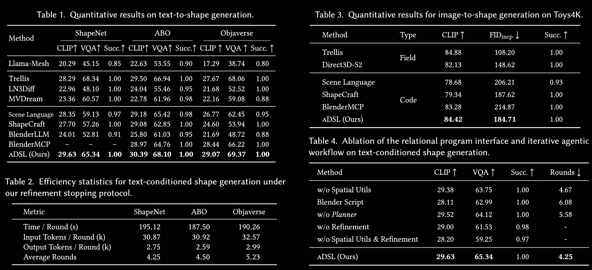

# aDSL: Agentic 3D Creation via Joint Agent-Program Design

## 1. 研究背景与论文动机

### 1.1 三维内容生成的发展背景

三维内容创建是 games、film production、CAD、robotics 和 embodied AI 的基础任务。近年来，三维生成主要沿两条路线发展：一类方法使用 diffusion models 等生成模型，直接从文本或图像预测 mesh、point cloud、implicit field 等几何表示；另一类方法将三维对象或场景表示为 **program**，由程序显式描述部件、参数、拓扑操作和空间关系。

程序化表示的优势在于具有 **fine-grained editing、interpretability、explicit structural control**：用户可以修改某一个部件、参数或装配关系，而不必重新生成整个网格。随着 LLM agent 出现，研究者开始让 LLM 编写 Blender Python、CAD code 或其他三维程序，以实现从自然语言到可执行几何的转换。

### 1.2 现有 LLM 三维建模方法的困难

直接生成低层三维代码存在明显脆弱性。用户说“把踏板安装在主体下方”“让键盘与桌面中心对齐”时，LLM 往往需要自行计算多个绝对坐标、旋转角度和尺寸参数。一个局部数值错误就可能导致部件漂浮、穿插、比例失衡或整个程序无法执行。

论文认为，问题来自 **programmatic interface 与 LLM reasoning strengths 的 mismatch**：

- 低层 Blender/Python 接口偏向 fragile numeric choices；
- LLM 更擅长 semantic structure、named parts 和 relative spatial relations；
- 传统生成流程通常只在生成结束后检查结果，缺乏基于程序语义的持续验证与修复。

已有工作虽然分别研究了 LLM 生成 Blender code、场景 DSL 或几何约束求解，但仍存在两方面不足：一是 DSL 未必把 spatial reasoning 作为一等公民；二是视觉反馈可能受到遮挡和透视影响，直接交给 LLM 进行 self-correction 容易产生误修复。

### 1.3 论文的基本假设与目标

论文的基本假设是：如果把常见几何操作和空间关系封装为更高层的 DSL 原语，LLM 就不必直接决定所有绝对坐标；如果再使用角色专门化 agents 对程序进行执行、渲染和代码层验证，就可以形成更稳定的 generate–verify–repair loop。

因此，论文提出两个联合设计的组件：

1. **aDSL（agent-centric Domain-Specific Language）**：以层级部件、组合几何和空间关系为核心的三维程序语言；
2. **role-specialized multi-agent system**：由 Planner、Coder、Executor、Debugger、Image Critic 和 Code Critic 组成的训练免费闭环。

论文希望解决的不是“让 LLM 一次性写出更长的三维代码”，而是改变 LLM 与三维几何交互的中间表示，使高层语义可以被执行、验证和局部编辑。

## 2. 方法总览

系统可以概括为同一个 structured representation 支持三类任务：

1. **text/image-conditioned asset modeling**；
2. **articulated asset modeling and editing**；
3. **scene-level composition**。

系统的闭环可以抽象为：

$$
\text{Input specification}
\xrightarrow{\text{Planner}}
\text{constraints}
\xrightarrow{\text{Coder}}
\text{aDSL program}
\xrightarrow{\text{Executor/Renderer}}
\text{geometry + images}
\xrightarrow{\text{Critics/Debugger}}
\text{repair feedback}.
$$

关键是 Planner、Coder、Critic 不是用互不相同的自然语言描述交流，而是围绕同一个 aDSL representation 交流。Planner 产生可检查关系，Coder 将关系编译为程序，Critic 再检查同样的关系。

## 3. aDSL 的设计原则

可以把 aDSL 理解为“为 LLM 设计的三维建模接口”。它并不是简单地增加几种几何体，而是针对 LLM 生成三维程序时的三个主要困难进行设计：

1. **不会表达复杂几何**：只提供 cube、sphere 等基础物体，难以建模真实资产；
2. **程序缺少结构**：所有几何混在一起，修改一个部件会影响整个模型；
3. **空间关系依赖手算坐标**：LLM 容易在对齐、放置和比例计算中出错。

因此，aDSL 的三个设计原则分别对应三个解决方案：

| 设计原则 | 解决的问题 | 主要机制 |
|---|---|---|
| **Expressiveness** | 如何表达复杂几何 | 参数化 primitives、transformations、Boolean/CSG operations |
| **Composability** | 如何组织和编辑复杂资产 | 命名部件、Asset hierarchy、attachment、parent-child relations |
| **Spatial reasoning** | 如何让 LLM 稳定表达空间关系 | placement、alignment、distribution 等 relational operators |

### 3.1 Expressiveness：让 DSL 能够表达复杂形状

aDSL 首先提供一组可调参数的基础几何体（`parameterized primitives`），例如 `cube`、`sphere` 和 `cylinder`。每个几何体不仅有类型，还有尺寸、位置、旋转和外观等参数，因此同一个 primitive 可以生成不同形状。

在此基础上，aDSL 支持几何变换和 Boolean operations：

$$
\text{shape}=\mathrm{difference}(\mathrm{union}(A,B),C).
$$

这条公式表示：先将 $A$ 和 $B$ 合并，再从合并结果中减去 $C$，即通过 **constructive solid geometry（CSG）** 进行建模。例如，可以用一个 cube 作为箱体，再用另一个 cube 做 `difference` 操作挖出凹槽。

这种方式比直接生成 mesh vertices 更适合 LLM：LLM 只需要说明“用一个主体减去一个切口”，而不用逐个计算大量顶点坐标。换句话说，aDSL 让 LLM 通过“几何操作步骤”描述形状，而不是直接描绘最终网格。

图 2(a) 展示 primitives、Boolean operations 和 transformations 如何组合；图 2(b) 展示如何先制造局部组件；图 2(c) 再展示如何进行 global assembly。由此，程序会保留“这个部件由哪些几何体和操作生成”的信息，而不是只留下一个无法解释的最终 mesh。

### 3.2 Composability：让复杂资产可以拆分、复用和编辑

aDSL 以 hierarchical `Asset` container 为基本组织单位。每个部件都有明确名称，并通过 `attach_part` 或 parent relation 组织成树状结构。例如，一个钢琴可以表示为：

```text
Piano
├── Body
├── Keyboard
├── Pedals
└── Cover
```

每个部件可以先独立建模，再装配成完整资产。这种“先分部件、后组装”的方式就是 composability。

层级结构带来三个直接收益：

- **局部编辑**：修改 `keyboard` 的尺寸或位置，不需要重写整个 `Piano`；
- **部件复用**：同一个 `Pedal` 或 `Handle` 可以被不同资产重复使用；
- **结构化运动**：移动父部件时，子部件保持相对关系，适合 articulation。

例如，将 `keyboard` 作为 `Piano` 的子部件后，修改钢琴主体的位置不会破坏键盘与主体的相对装配关系。相比把所有几何合并成一个无语义 mesh，这种层级表示更适合 agentic editing 和 articulated modeling。

### 3.3 Spatial reasoning：让 LLM 用“关系”而不是手算坐标

aDSL 的第三个原则是把常见空间关系封装成 `relational operators`，例如 `placement`、`center alignment`、`distribution` 和 `attachment`。这些算子将多步坐标计算压缩成一条具有明确语义的程序语句。

例如，需求是“把面包片放入槽位并对齐中心”。低层代码可能需要手动计算：

$$
(x,y,z)=(1.37,-0.42,0.85).
$$

而 aDSL 可以直接写成：

$$
\mathrm{align}(\text{bread},\text{slot}).
$$

再如“把踏板放在主体下方并保持连接”，可以表示为：

$$
\mathrm{place\_on}(\text{pedal},\text{body}).
$$

`align` 和 `place_on` 的具体坐标由 DSL 执行器根据对象的尺寸、坐标系和已有布局关系计算。这样，LLM 不需要自己保证 x、y、z 数值完全正确，而是负责选择合适的空间关系。

因此，aDSL 的空间推理并不是放弃几何精确性，而是把精确计算从 LLM 转移给程序执行器。LLM 负责表达“谁与谁对齐、谁放在哪里”，DSL 负责将这些关系转换为可执行的几何变换。

## 4. Agent system：Plan–Execute–Critic

### 4.1 Planner

Planner 将用户文本或图像条件转化为：

- 部件列表与命名层级；
- 结构关系和尺寸比例；
- 空间约束；
- 后续可验证的 checklist。

例如，“heavy workbench covers most of the back wall”不仅被理解为一个整体视觉描述，还应转为工作台、墙面、工具、task light 等部件及其相对位置关系。

### 4.2 Coder

Coder 根据 Planner 的约束、DSL 文档和示例生成 aDSL 程序。论文强调 Coder 不应自由调用未知 API，而要遵循给定 primitives、operators 和层级结构，以保证程序可执行。

### 4.3 Executor 与 Renderer

Executor 执行程序并生成 mesh representation。Renderer 从多个视角生成 snapshots，尽量减少 self-occlusion 并覆盖局部几何细节。

这里的多视角渲染不是单纯为了展示，而是 Critic 的观测输入。系统把几何状态和视觉证据结合起来，避免仅凭单个角度判断。

### 4.4 Debugger

若执行失败，Debugger 根据 runtime error signals 提出 targeted patches，包括 invalid parameters、missing definitions 和 malformed operator usage 等。修复反馈回到 Coder，形成执行层面的闭环。

### 4.5 Image Critic 与 Code Critic

执行成功后进入 critique stage：

1. **Image Critic** 对多视角图像与 Planner checklist 进行比较，发现缺失部件、比例不对和明显位置错误。
2. **Code Critic** 将视觉反馈与实际 aDSL program 对照，判断该反馈是否真的由程序导致。
3. Code Critic 作为 final adjudicator，只把有效、可定位的问题交回 Coder。

论文特别强调这一层代码交叉验证：图像中的遮挡或透视可能让 Image Critic 误以为缺少部件；Code Critic 可以根据程序结构拒绝这类 hallucinated criticism。

## 5. 实验与应用分析

### 5.1 实验目标与总体设置

论文实验主要验证四个问题：

1. aDSL 是否能在 text-to-shape 中提升语义一致性和结构有效性
2. aDSL 是否能在 image-to-shape 中保留输入图像的视觉结构
3. 性能提升究竟来自 DSL 的空间算子，还是仅仅来自多轮 agent 修正
4. aDSL 是否支持 articulation、局部 shape editing 和 scene-level modeling 等下游任务

实现上，所有 agents 使用 `Gemini 3 Pro`，temperature 为 1.0；self-correction 最多运行 10 轮，如果 Critic 不再提出 actionable issue 就提前终止。每个物体渲染 8 个视角，方位角间隔 45°、固定仰角 15°，分辨率为 1024×1024，使用 neutral materials 和统一环境光照。论文报告的实验均不使用用户在生成过程中的额外反馈。

### 5.2 对比方法

论文从三类三维生成范式选择 baseline：

| 类型 | 方法 | 特点 |
|---|---|---|
| Code generation | BlenderMCP、BlenderLLM、LL3M、Scene Language、ShapeCraft | 生成代码，再执行代码得到 mesh |
| Field generation | MVDream、LN3Diff、Trellis、Direct3D-S2 | 生成 implicit field 或相关三维表示，再转为 mesh |
| Mesh generation | Llama-Mesh | 直接输出 triangle mesh |

其中，field-based 和 mesh-based 方法通常依赖大规模 3D training data，论文将它们作为跨范式参考；aDSL 与 code-generation baseline 更直接可比，因为它们都通过程序或代码完成三维生成。需要 LLM 的 baseline 使用相近能力的模型：Scene Language 和 ShapeCraft 使用 `Gemini 3 Pro`，BlenderMCP 使用 `Claude Opus 4.5`。

### 5.3 评价指标

论文使用四类指标衡量语义、视觉和结构质量：

- **CLIP-Score**：输入条件与生成物体多视角渲染图的 embedding cosine similarity，衡量整体语义对齐
- **VQAScore**：使用 CLIP-FlanT5 判断渲染图是否蕴含输入文本，仅用于 text-to-shape
- **FID-Inception**：使用 Inception-v3 提取生成视图与真实视图特征，衡量 image-to-shape 的视觉分布差异，越低越好
- **Execution Success Rate**：能够完成程序执行并生成有效、可渲染 mesh 的 prompt 比例

如果方法无法生成 valid output，论文将其所有指标记为 0

实验数据汇总：



### 5.4 实验一：Text-to-shape generation

#### 数据集与设置

论文构建了 100 个随机采样的 text-conditioned instances：

- `ShapeNet`：60 个实例；
- `ABO`：20 个实例；
- `Objaverse`：20 个实例。

每个实例使用来自 `CAP3D` 和 `MARVEL` 的两种 prompt templates，因此形成 **200 个 evaluation prompts**。这些模板提供互补的语言描述，覆盖物体类别、结构、属性和空间关系。所有 text-to-shape 方法直接使用原始 prompt，不额外进行 prompt engineering。

#### 主要结果

在三个数据集上，aDSL 都是 code-generation 方法中表现最好的方法，并且 Execution Success Rate 均为 1.00：

| Dataset | aDSL CLIP | aDSL VQA | aDSL Success |
|---|---:|---:|---:|
| ShapeNet | 29.63 | 65.34 | 1.00 |
| ABO | 30.39 | 68.10 | 1.00 |
| Objaverse | 29.07 | 69.37 | 1.00 |

与主要 code baseline 对比：

- ShapeNet 上，aDSL 的 CLIP 29.63，高于 Scene Language 的 28.35 和 ShapeCraft 的 27.70；VQA 65.34，也高于二者的 59.13 和 57.26。
- ABO 上，aDSL 达到 CLIP 30.39、VQA 68.10，高于 Scene Language 的 29.18/65.42 和 ShapeCraft 的 29.08/62.85。
- Objaverse 上，aDSL 达到 CLIP 29.07、VQA 69.37，高于 Scene Language 的 26.77/62.45 和 ShapeCraft 的 24.60/53.94。

与 field-based 方法相比，Trellis 在某些数据集上可能具有较高的视觉/语义分数，但 aDSL 的优势在于生成结果同时具备 hierarchical program structure、editability 和 100% execution success，并能显式保持 prompt 中的部件关系。论文 Fig. 5 中的定性对比也显示，field-based 方法可能生成外观较丰富的结果，却遗漏诸如桌面上“4 个特定图案”等细粒度约束。

### 5.5 实验二：Image-to-shape generation

#### 数据集与设置

论文从 `Toys4K` 随机采样 30 个实例。每个物体从随机 viewpoint 渲染一张图像作为输入，不提供额外文本描述或 prompt expansion，因此这是纯粹的 **image-to-shape protocol**。

#### 主要结果

在 image-to-shape 任务中，aDSL 的结果为：

| Method | 类型 | CLIP | FID-Inception | Success |
|---|---|---:|---:|---:|
| Trellis | Field | 84.88 | 108.20 | 1.00 |
| Direct3D-S2 | Field | 82.13 | 148.62 | 1.00 |
| Scene Language | Code | 78.68 | 206.21 | 0.93 |
| ShapeCraft | Code | 79.34 | 187.62 | 1.00 |
| BlenderMCP | Code | 83.28 | 214.87 | 1.00 |
| **aDSL** | **Code** | **84.42** | **184.71** | **1.00** |

aDSL 在 code-generation 方法中取得最高 CLIP 和最低 FID-Inception；与 Trellis 相比，CLIP 略低，但 FID-Inception 明显更低，说明其生成视图与真实视图分布更接近。Fig. 6 的定性结果显示，aDSL 比其他代码生成方法更容易保留参考图像中的整体结构，同时保持程序可编辑性。

### 5.6 实验三：DSL 与 agent workflow 消融

论文通过消融拆分“表示语言”和“智能体工作流”两个因素。

#### DSL 消融

1. **Remove spatial utilities**：删除 spatial reasoning utilities 和 declarative layout operators，迫使模型手动进行 coordinate arithmetic。
2. **Raw Blender Python**：保留 agentic framework，但把 aDSL 替换为原始 Blender Python，测试提升是否来自 DSL 而不是 agent 本身。

结果显示：

- 完整 aDSL 平均需要 4.25 个 self-correction rounds；
- 使用 raw Blender scripting 后增加到 6.08 轮；
- 删除 spatial utilities 后增加到 4.67 轮，VQA 从 65.34 降至 63.75。

这说明空间算子不仅提高表达便利性，也降低了 agent 修复复杂空间关系的难度。

#### Agent workflow 消融

1. **Remove planning stage**：让 Coder 直接从用户需求生成程序，且 Critic 不再拥有结构化 checklist。
2. **Disable self-correction loop**：只进行 single-pass execution，不做迭代验证和修复。

结果显示：

- 删除 planning 后，平均 refinement rounds 从 4.25 增加到 5.58；
- 禁用 self-correction 后，VQA 降至 61.53；
- execution success rate 降至 0.98。

因此，aDSL 的收益不是单独来自 DSL，也不是单独来自多轮 agent，而是来自两者的联合：DSL 把空间关系表示成可验证的形式，refinement loop 再利用这些关系进行错误检查和修复。

### 5.7 人工用户研究与效率

论文在 20 个案例上将 aDSL 与 Scene Language 进行 pairwise user study，其中包含 15 个 text-to-shape cases 和 5 个 image-to-shape cases，共招募 38 名参与者。参与者分别评价：

- **Prompt alignment**：语义、空间关系和属性是否符合输入；
- **Geometric/visual quality**：几何合理性、完整性和 artifacts。

参与者偏好 aDSL 的比例为：

- Prompt alignment：**85.39%**；
- Geometric/visual quality：**86.84%**。

效率方面，完整流程平均约 190 秒，平均 4.25 轮 refinement。论文还展示了上下文复用的效果：初始 motorcycle 需要 5 轮、约 845 秒；在已有程序结构基础上生成 cyber-punk variant，只需 1 轮、约 164 秒。这说明 aDSL 的程序结构不仅用于首次生成，也能降低后续交互式编辑成本。

### 5.8 下游应用

- **Articulated Shape Generation**：通过 part hierarchy 和 joint definitions 生成 sliding components、rotating handles、hinged doors 和 articulated limbs，统一表示几何与运动结构。
- **Shape Editing**：采用 localized program rewriting，不重新生成整个 mesh；只修改 primitive type、object count 或 spacing 等相关语句，并保持无关部件和 connectivity 不变。
- **High-Fidelity Shape Generation**：将 aDSL mesh 作为 `SpaceControl` 的 spatial constraint，约束 Trellis 等预训练生成器，使结果同时获得更高几何细节和可编辑的全局结构。
- **Scene Generation**：通过 placement、alignment 等空间算子放置多个资产，扩展到 scene-level composition。

总体来看，实验支持论文的核心主张：aDSL 的 relational program interface 提升了结构可控性，Plan–Execute–Critic loop 提升了执行可靠性，而二者的联合才带来更好的 robustness、controllability 和 editability。

## 6. 局限性

- **DSL expressiveness bottleneck**：如果 primitives、材质和布尔操作不足，再强的 agent 也无法生成超出语言表达能力的几何。
- **2D verification ambiguity**：多视角图像仍可能遗漏背面、内部结构或精确碰撞，Critic 需要更强的几何查询接口。
- **LLM dependency**：复杂层级规划和长程修复依赖强模型，较小模型可能产生循环错误。
- **成本问题**：每轮 execute/render/critique 都有计算和推理成本。
- **缺少统一的严格指标**：robustness、controllability 和 editability 的评价需要更多可重复的 benchmark、成功率和用户研究。

## 7. aDSL与PSDL的异同

相同点：两者都是使用结构化的程序语言来表达空间关系，避免使用自然语言和绝对坐标去描述

不同点：1.研究目标：PSDL主要解决场景布局问题（例如场景中有哪些物体，物体摆放是否合理等），aDSL主要解决物体的组成和装配问题（例如一个物体有哪些模块构成，模块之间怎么装配等）

2. 优化机制不同：PSDL通过定义loss函数、在尽量保持原有程序结构的情况下小幅修改来降低loss值；aDSL采用 Plan–Execute–Critic 闭环，主要通过多智能体的计划、执行、检查、审查进行语义层面的优化
